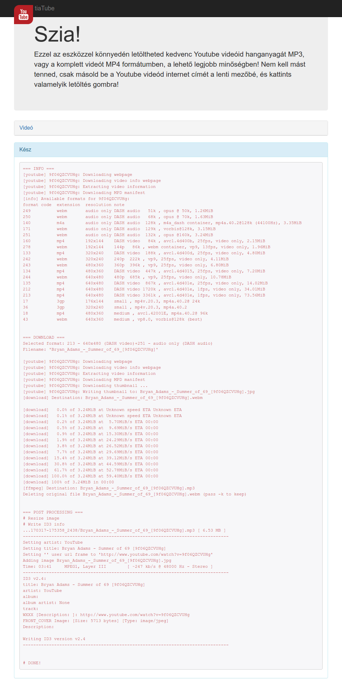

#  tiaTube
This is a minimal ``youtube-dl`` frontend in Hungarian language.

## Setup
1. Download source to ``/opt/tiatube`` directory.
2. Run ``install.sh``
3. Share ``/opt/tiatube/www`` directory with PHP supported web server (e.g. **apache2**)

## Screenshots
* Main page  
* Download finished  
